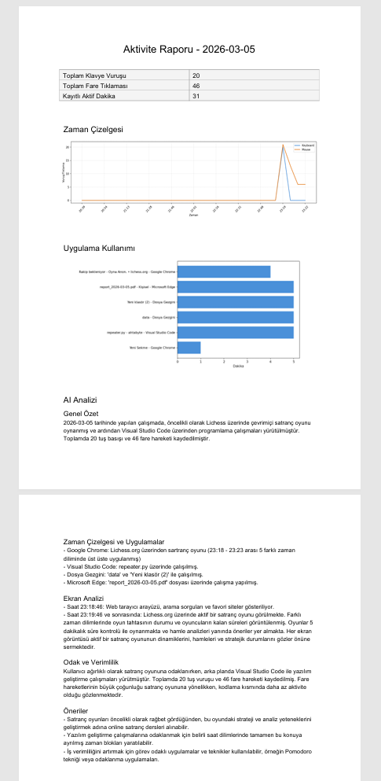
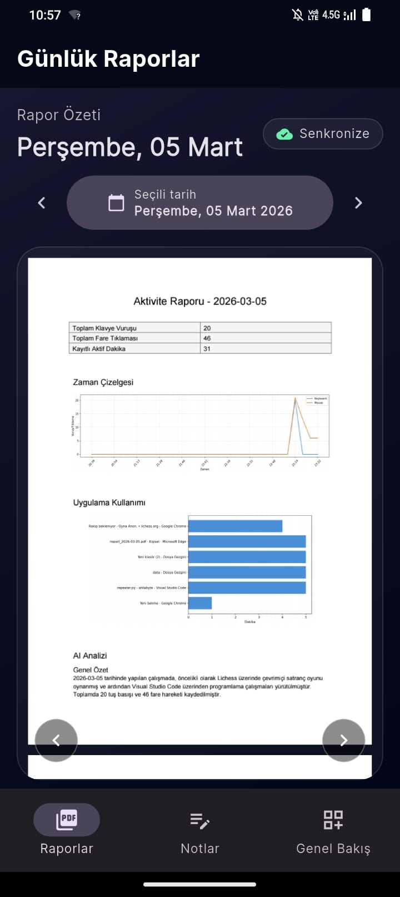
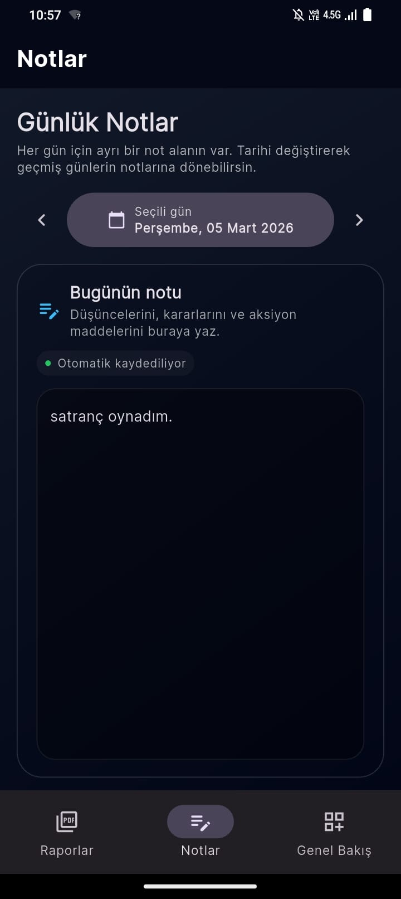

# 🐙 Ahtabyte

> **TR:** Bilgisayar aktivitelerinizi takip eden, AI destekli günlük rapor üreten ve mobil uygulamayla sunan kişisel verimlilik asistanı.
>
> **EN:** A personal productivity assistant that tracks your computer activity, generates AI-powered daily reports, and presents them via a mobile app.

---

## 📸 Screenshots, GIFs / Ekran Görüntüleri, GIF'ler







---

## 🏗️ Architecture / Mimari

```
┌─────────────────────────────────────────────────────┐
│                     Desktop (PC)                    │
│                                                     │
│  ┌──────────┐    ┌──────────┐    ┌──────────────┐  │
│  │Tick      │    │Window    │    │Screen        │  │
│  │Collector │    │Collector │    │Capture       │  │
│  └────┬─────┘    └────┬─────┘    └──────┬───────┘  │
│       │               │                 │           │
│       └───────────────┴─────────────────┘           │
│                       │                             │
│               ┌───────▼────────┐                   │
│               │   Repeater     │  (every 60s)       │
│               └───────┬────────┘                   │
│                       │                             │
│               ┌───────▼────────┐                   │
│               │  RAG Pipeline  │                   │
│               │  (GPT-4o-mini) │                   │
│               └───────┬────────┘                   │
│                       │                             │
│               ┌───────▼────────┐                   │
│               │   db.json      │                   │
│               └───────┬────────┘                   │
│                       │                             │
│         ┌─────────────┴──────────────┐             │
│         │                            │             │
│  ┌──────▼──────┐            ┌────────▼──────┐      │
│  │ Flask API   │            │  PDF Report   │      │
│  │ server.py   │            │  pdf.py       │      │
│  └──────┬──────┘            └───────────────┘      │
│         │                                           │
└─────────┼───────────────────────────────────────────┘
          │ ngrok
          │
┌─────────▼───────────┐
│   Flutter Mobile    │
│   (Android)         │
└─────────────────────┘
```

---

## 🧰 Technologies / Teknolojiler

| Kategori | Teknoloji |
|---|---|
| Data Collection | Python, pynput, pyautogui, pygetwindow |
| AI / LLM | OpenAI GPT-4o, GPT-4o-mini |
| Storage | JSON (db.json) |
| API | Flask, ngrok |
| PDF Report | ReportLab, Matplotlib |
| UI (Desktop) | PyQt6 |
| Mobile | Flutter (Android) |

---

## 📁 Project Structure / Proje Yapısı

```
ahtabyte/
├── src/
│   ├── core/
│   │   ├── tickcollect.py      # Keyboard & mouse tracker
│   │   ├── wincollect.py       # Active window collector
│   │   ├── visscollect.py      # Screen capture
│   │   ├── rag.py              # RAG pipeline (GPT-4o)
│   │   └── pdf.py              # PDF report generator
│   ├── streaming/
│   │   └── repeater.py         # Main loop (every 60s)
│   ├── api/
│   │   └── server.py           # Flask REST API
│   └── ui/
│       └── trigger.py          # PyQt6 octopus effect
├── app/                        # Flutter mobile app
├── data/
│   ├── db.json                 # Activity database
│   ├── screenshots/            # Screen captures
│   └── report_YYYY-MM-DD.pdf   # Generated reports
├── media/
│   └── octosprite.gif
├── .env                        # API keys (not in repo)
└── requirements.txt
```

---

## 🚀 Setup / Kurulum

### Prerequisites / Gereksinimler

- Python 3.12+
- Flutter SDK
- OpenAI API Key
- ngrok account

### Installation / Kurulum Adımları

```bash
# 1. Clone the repo
git clone https://github.com/bariscanceken/ahtabot.git
cd ahtabot

# 2. Create virtual environment
python -m venv .venv
.venv/Scripts/activate  # Windows
source .venv/bin/activate  # macOS/Linux

# 3. Install dependencies
pip install -r requirements.txt

# 4. Create .env file
echo "OPENAI_API_KEY=your_key_here" > .env
```

---

## 🎮 Usage / Kullanım

### Start Data Collection / Veri Toplamayı Başlat

```bash
python src/streaming/repeater.py
```

> Collects keyboard, mouse, active windows and screen data every 60 seconds.
> Her 60 saniyede klavye, mouse, pencere ve ekran verisi toplar.

### Generate PDF Report / PDF Rapor Oluştur

```bash
python src/core/pdf.py
# Enter date: 2026-03-05
```

### Start API Server / API Sunucusunu Başlat

```bash
# Terminal 1
python src/api/server.py

# Terminal 2
ngrok http 5000
```

### Mobile App / Mobil Uygulama

```bash
cd app
flutter run
```

---

## ⚙️ Configuration / Yapılandırma

`src/streaming/repeater.py` içinde:

```python
self.capture_every_n = 5  # Screenshot frequency (0 = disabled)
```

---

## 🔒 Security / Güvenlik

- API key authentication via `X-API-Key` header
- `.env` and `config.dart` excluded from repository
- ngrok URL changes on every restart

---

## 📋 Roadmap

- [x] Data collection pipeline
- [x] RAG system with GPT-4o
- [x] PDF report generation
- [x] Flask REST API
- [x] Flutter mobile app
- [ ] RNN behavior prediction
- [ ] Scheduled daily reports
- [ ] Cloud deployment

---

## 💡 Motivation / Motivasyon

**TR:**
İki sorunum vardı:
1. Obsidian'da günlük log yazmak için zaman ayırmak istemiyordum, çok üşeniyordum.
2. Mobilde not tutma uygulamaları ücretli, para ödemek istemedim.

Çözüm: Aktivite verilerini otomatik topla, MD raporu üret (Obsidian'a import edilebilir), PDF raporu üret (mobilde ücretsiz görüntülenebilir).

**EN:**
I had two problems:
1. I was too lazy to manually write daily logs in Obsidian.
2. Mobile note-taking apps cost money, and I didn't want to pay.

Solution: Auto-collect activity data, generate MD reports (importable to Obsidian), and PDF reports (viewable on mobile for free).

---

## 🐙 About / Hakkında

**TR:** Bu proje, günlük bilgisayar kullanımını takip ederek verimlilik analizi yapmayı amaçlar. Makine öğrenmesi ve büyük dil modelleri birleştirilerek kişisel bir asistan oluşturulmuştur.

**EN:** This project aims to analyze productivity by tracking daily computer usage. A personal assistant is created by combining machine learning and large language models.
